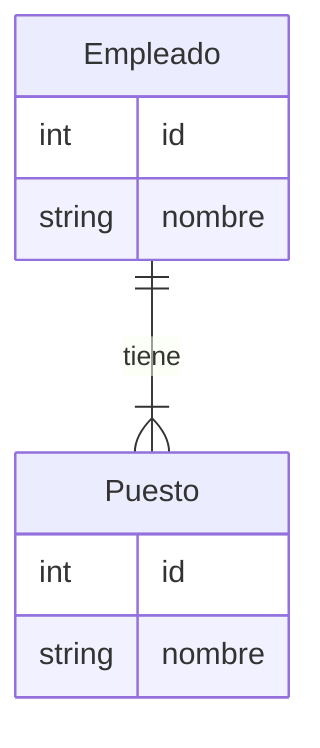
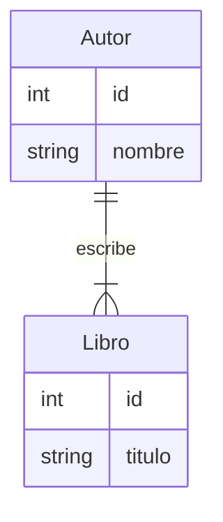
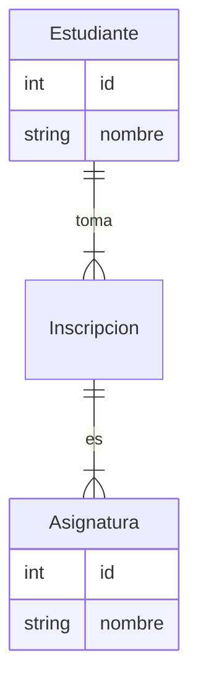

## Modelo Entidad-Relación (E-R)

### ¿Qué es?

El MER es una herramienta para modelar bases de datos, asegurando una organización eficiente y comprensible de la información. Representa entidades (objetos o conceptos), sus atributos (características) y las relaciones entre ellas.


### Componentes:
* **Entidades:** Objetos del mundo real a representar (e.g., "Cliente", "Producto").
* **Atributos:** Características de las entidades (e.g., "nombre", "precio").
* **Relaciones:** Vínculos entre entidades (e.g., "un cliente compra muchos productos").

### Representación gráfica:
* **Entidades:** Rectángulos
* **Atributos:** Óvalos conectados a entidades
* **Relaciones:** Líneas que conectan entidades

### ¿Por qué usarlo?
* **Organización:** Estructura lógica de la información.
* **Diseño:** Base para el diseño de bases de datos.
* **Comunicación:** Facilita la comprensión entre equipos.
* **Flexibilidad:** Adaptable a diferentes bases de datos.

### Ejemplo simple:
**Base de datos de una biblioteca**
* **Entidades:** Libro, Autor, Editorial
* **Atributos:** Título, Autor, ISBN, Nombre, Apellido, País
* **Relaciones:** Un libro es escrito por un autor, un libro es publicado por una editorial.

* **Tipos de relaciones:** Uno a uno, uno a muchos, muchos a muchos.
* **Diagramas ER:** Representación gráfica del MER.
* **Normalización:** Proceso de optimización de una base de datos.

```


```


## Cardinalidad en el Modelo Entidad-Relación

La cardinalidad define la cantidad de instancias de una entidad que pueden relacionarse con una instancia de otra entidad. Es una parte fundamental para entender cómo se conectan las entidades en una base de datos.

### Tipos de Cardinalidad
* **Uno a Uno (1:1):** Una instancia de una entidad se relaciona con, como máximo, una instancia de otra entidad.
* **Uno a Muchos (1:N):** Una instancia de una entidad se puede relacionar con muchas instancias de otra entidad, pero una instancia de la segunda entidad solo puede relacionarse con una de la primera.
* **Muchos a Muchos (N:M):** Una instancia de una entidad se puede relacionar con muchas instancias de otra entidad, y viceversa.

### Representación Gráfica en Markdown
Para representar tablas y relaciones en Markdown, utilizaremos una notación sencilla. Una línea `|` separará las columnas y un guión `-` definirá la fila de encabezados. Para las relaciones, usaremos flechas que apunten de la entidad con la cardinalidad "uno" a la entidad con la cardinalidad "muchos".

### Ejemplos con Tablas y Relaciones

#### 1. Uno a Uno (1:1)
**Ejemplo:** Un empleado tiene un único puesto de trabajo y un puesto de trabajo es ocupado por un único empleado.

| Empleado | Puesto |
|---|---|
| Juan Pérez | Gerente |
| Ana López | Analista |



#### 2. Uno a Muchos (1:N)
**Ejemplo:** Un autor puede escribir muchos libros, pero un libro solo puede ser escrito por un autor.

| Autor | Libro |
|---|---|
| J.K. Rowling | Harry Potter |
| J.K. Rowling | Animales Fantásticos |
| Stephen King | It |



#### 3. Muchos a Muchos (N:M)
**Ejemplo:** Un estudiante puede tomar muchas asignaturas y una asignatura puede ser tomada por muchos estudiantes.

| Estudiante | Asignatura |
|---|---|
| Juan Pérez | Matemáticas |
| Juan Pérez | Física |
| Ana López | Historia |
| Ana López | Matemáticas |

**Nota:** Para representar relaciones muchos a muchos, se introduce una entidad intermedia (tabla de unión) que conecta las dos entidades principales.



### Consideraciones Adicionales
* La cardinalidad es fundamental para definir las reglas de integridad referencial en una base de datos.
* La elección de la cardinalidad correcta depende del contexto y las necesidades del sistema.
* El diagrama entidad-relación (DER) es una herramienta visual que facilita la comprensión de las relaciones entre las entidades.


```


```


### **NORMALIZACIÓN**


### **Ejemplo Base de Datos de un Restaurante**

Imaginemos que estamos diseñando una base de datos para un restaurante, donde queremos almacenar información sobre los clientes y sus pedidos.

Este proceso de normalización ayuda a organizar la base de datos de manera eficiente, reduciendo la redundancia de datos y mejorando la integridad y consistencia de la información.

#### **0FN (Forma No Normalizada):**
En esta etapa, todos los datos se almacenan en una sola tabla sin estructura formal:

| ClienteID | ClienteNombre | Pedido1         | Pedido2         | Pedido3         |
|-----------|---------------|-----------------|-----------------|-----------------|
| 1         | Juan Pérez    | "Pizza"         | "Ensalada"      | NULL            |
| 2         | María Gómez   | "Sopa"          | "Tacos"         | "Refresco"      |
| 3         | Luis López    | "Hamburguesa"   | NULL            | NULL            |

**Problemas:**
- **Redundancia:** Los pedidos están en columnas separadas, lo que complica la actualización y el mantenimiento.
- **Nulls:** Hay muchas celdas vacías, lo que es ineficiente.

#### **1FN (Primera Forma Normal):**
Para alcanzar la primera forma normal, eliminamos los grupos repetidos y aseguramos que cada columna contenga valores atómicos (no divisibles):

| ClienteID | ClienteNombre | Pedido          |
|-----------|---------------|-----------------|
| 1         | Juan Pérez    | "Pizza"         |
| 1         | Juan Pérez    | "Ensalada"      |
| 2         | María Gómez   | "Sopa"          |
| 2         | María Gómez   | "Tacos"         |
| 2         | María Gómez   | "Refresco"      |
| 3         | Luis López    | "Hamburguesa"   |

**Mejoras:**
- Los pedidos se almacenan en filas separadas.

**Problema:**
- **Redundancia de datos:** El nombre del cliente se repite para cada pedido.

#### **2FN (Segunda Forma Normal):**
Para alcanzar la segunda forma normal, eliminamos la redundancia parcial, donde las columnas no clave dependen completamente de la clave primaria compuesta.

- Primero, identificamos las dependencias: `ClienteID` y `Pedido` forman una clave compuesta.
- Luego, dividimos la tabla en dos:

**Tabla Clientes:**

| ClienteID | ClienteNombre |
|-----------|---------------|
| 1         | Juan Pérez    |
| 2         | María Gómez   |
| 3         | Luis López    |

**Tabla Pedidos:**

| PedidoID | ClienteID | Pedido          |
|----------|-----------|-----------------|
| 1        | 1         | "Pizza"         |
| 2        | 1         | "Ensalada"      |
| 3        | 2         | "Sopa"          |
| 4        | 2         | "Tacos"         |
| 5        | 2         | "Refresco"      |
| 6        | 3         | "Hamburguesa"   |

**Mejoras:**
- El nombre del cliente se almacena solo una vez en la tabla Clientes, reduciendo la redundancia.

**Problema:**
- **Dependencia transitiva:** Podríamos querer almacenar información adicional sobre los pedidos, como el precio o la categoría del platillo.

#### **3FN (Tercera Forma Normal):**
Para alcanzar la tercera forma normal, eliminamos las dependencias transitivas, donde una columna no clave depende de otra columna no clave.

**Tabla Clientes:**

| ClienteID | ClienteNombre |
|-----------|---------------|
| 1         | Juan Pérez    |
| 2         | María Gómez   |
| 3         | Luis López    |

**Tabla Pedidos:**

| PedidoID | Pedido          | Precio | Categoría   |
|----------|-----------------|--------|-------------|
| 1        | "Pizza"         | 12.00  | "Comida"    |
| 2        | "Ensalada"      | 8.00   | "Comida"    |
| 3        | "Sopa"          | 6.50   | "Comida"    |
| 4        | "Tacos"         | 9.00   | "Comida"    |
| 5        | "Refresco"      | 2.50   | "Bebida"    |
| 6        | "Hamburguesa"   | 10.00  | "Comida"    |

**Tabla Clientes_Pedidos:**

| ClienteID | PedidoID |
|-----------|----------|
| 1         | 1        |
| 1         | 2        |
| 2         | 3        |
| 2         | 4        |
| 2         | 5        |
| 3         | 6        |

**Mejoras:**
- Ahora, la información de los pedidos (precio y categoría) se almacena en su propia tabla, y la relación entre clientes y pedidos se maneja a través de la tabla intermedia `Clientes_Pedidos`.

### **Resumen de Formas Normales:**
- **1FN:** Asegura que los datos estén en un formato tabular simple, con cada columna conteniendo valores indivisibles.
- **2FN:** Elimina la redundancia parcial asegurando que todas las columnas no clave dependan completamente de la clave primaria.
- **3FN:** Elimina las dependencias transitivas, asegurando que las columnas no clave no dependan de otras columnas no clave.
